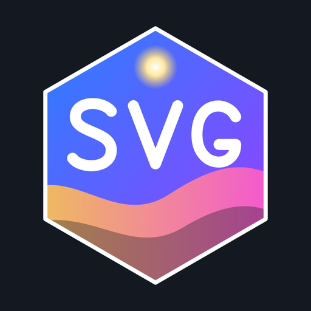

# svg_h.aux2



[English](README.en.md) | 日本語

[sevenc-nanashi/svg.aux2](https://github.com/sevenc-nanashi/svg.aux2)（作者: Nanashi、MIT License）のフォーク。ストローク（線幅・線種・端・角など）拡張を加えた SVG レンダラーです。

本家から変えた点（詳細は下の各節）:

- フィルタ名を `SVG_H` にし、本家の `SVG` と同時に入れても衝突しないようにした
- 塗り・線の上書き、線の描画進行、クリッピング、部分描画（要素 ID）、サイズ基準などの設定を追加した
- `.svgz`、相対パスの画像、外部で保存し直した SVG の読み直しに対応した
- GCMZDrops2 用のドロップハンドラー（`.svg` / `.svgz` → `SVG_H`）を同梱した

## 動作環境

- AviUtl ExEdit2 **beta46 以降**（使っている SDK [aviutl2-rs](https://github.com/sevenc-nanashi/aviutl2-rs) 0.29 の最小サポート）。動作確認は 2.1.11a
- GCMZDrops2 のハンドラーを使う場合は [GCMZDrops2](https://github.com/oov/aviutl2_gcmzdrops2)（無くてもプラグイン本体は動く）

## 導入

1. [Releases](https://github.com/HexBrowns/svg_h/releases) から zip をダウンロードして展開する
2. 中の `Plugin` フォルダと `Language` フォルダを、AviUtl2 のデータフォルダ（既定は `C:\ProgramData\aviutl2`）へコピーする。次の 3 つが置かれる
   - `Plugin\svg_h\svg_h.aux2`（プラグイン本体）
   - `Language\English.svg_h.aul2`（英語の表示名）
   - `Plugin\GCMZDrops\GCMZScript\svg_h2obj.lua`（GCMZDrops2 用のドロップハンドラー。GCMZDrops2 を入れていなければ使われない）
3. AviUtl2 を再起動する（起動中にコピーした場合も、再起動するまで読み込まれない）
4. `SVG_H` を置き、`ファイル` に SVG を指定する

本家の `svg.aux2` と同時に入れてかまわない（下の「本家との識別子差分」）。

> [!TIP]
> このプラグインは幅・高さのパラメーターが変わるたびにSVGの再レンダリングを行います。
> SVGをリサイズするようなアニメーションをする場合は、幅・高さを固定し、ほかのフィルタ効果で拡大・縮小することをおすすめします。

## 本家との識別子差分（共存用）

| 項目 | 本家 | 本フォーク |
|------|------|-----------|
| パッケージ id | `sevenc-nanashi.svg-aux2` | `svg-h-aux2` |
| プラグインファイル | `Plugin/svg.aux2` | `Plugin/svg_h/svg_h.aux2` |
| フィルタ名 | `SVG` | `SVG_H` |
| ドロップハンドラ | `svg.aux2` | `svg_h.aux2` |
| キャッシュ名前空間 | （なし） | `svg_h:v2:` |

## 設定項目（本家に無いもの）

| 項目 | 内容 |
|---|---|
| サイズ基準 | 「アスペクト比の維持」のときの大きさの決め方。`幅`（既定・従来どおり）/ `高さ` / `枠に収める`（幅×高さに収める。本家と同じ） |
| 塗りを上書き | 見えている塗りをすべて「色」にする。`fill="none"` の部分（線だけのアイコン）は塗らない |
| 塗り透明度 / 線透明度 | SVG 自身の不透明度に**掛ける**（100% なら SVG のまま） |
| 描画順 | `塗りの上に線` は SVG のまま描く。`線の上に塗り` を選んだときだけ全体に強制する |
| ストローク | 「ストロークを上書き」で全パスに線を付ける。`線幅の単位` を `出力px` にすると、SVG の大きさや「幅」に関係なく画面上の太さで指定できる |
| 線の描画進行 | 線を描いていくアニメーション。`描画開始` / `描画終了`（%）で見せる区間を決める。`個別` は線ごとに同じ割合、`順番` は文書順に 1 本ずつ。塗りはそのまま（消したいときは塗り透明度を 0 に）。途中の区間では線種の設定より優先される |
| クリッピング | 左・上・右・下を SVG の単位で切り取る（小数可）。切り取ったときは線の上書きのはみ出し余白を取らない |
| 部分描画 › 要素ID | SVG 内の `id` を指定すると、その要素だけを**元の位置のまま**描く（`g` / `path` / `use` などの id）。同じ SVG を ID 違いで重ねるとパーツごとに動かせる。見つからないときは赤い × を出す |

- `.svgz` も読める。SVG が相対パスで参照する画像は、SVG ファイルのフォルダを基準に読む
- SVG ファイルを外部で保存し直すと、次の描画で読み直す（更新日時とサイズを見ている）
- 読めないときは赤い枠と × を出し、ログには同じ失敗を 1 回だけ出す
- 出力は 1 辺 8192px まで。超えるときは縦横比を保ったまま縮める
- viewBox の外にある図形は描かない（本家と同じ）。線の上書きでは端からはみ出す線の分だけ 4 辺に余白を取る

### 0.8.0 で見た目が変わる場合

以前の版で作ったプロジェクトでも、次に当てはまると描かれ方が変わる（不具合の修正による）。

- アンチエイリアスの縁と半透明の部分が明るくなる（以前は暗くなっていた）
- SVG 自身の `fill-opacity` / `stroke-opacity` / `paint-order` が効くようになる
- クリッピングが切り取りとして効くようになる（以前は拡大になっていた）
- viewBox の外の図形が消え、画像の大きさと中心がその分変わる

## GCMZDrops 対応

[GCMZDrops2](https://github.com/oov/aviutl2_gcmzdrops2) 経由のドロップは、ハンドラー `svg_h2obj.lua` が受け持ちます。

- `.svg` / `.svgz` → `SVG_H`。それ以外の拡張子（`.txt` など）は拾わず、そのまま後のハンドラーと GCMZDrops 本体に渡す
- 優先度 900。同じ GCMZScript にある `svg2obj.lua`（`.svg` → 本家の `SVG`、優先度 1000）より先に拾う
- ブラウザーなどから落とした SVG は一時フォルダにあるので、GCMZDrops の保存先（設定の「保存先」）へ `名前.ハッシュ.svg` として複製してから参照します
- ハンドラーを入れた・入れ替えた後は AviUtl2 の再起動が必要です（GCMZDrops は起動時にハンドラーを読む）

## ビルド（開発者向け）

リポジトリのルートで実行する。ビルドした `svg_h.aux2` と `English.svg_h.aul2`、ハンドラーを `C:\ProgramData\aviutl2` の下へ配置する。

```powershell
.\build.ps1
.\build.ps1 -HandlerOnly   # GCMZDrops ハンドラーだけ配置する
cargo test --lib           # 描画の単体テスト（src/render.rs / src/rewrite.rs）
```

- ハンドラーの正本は `assets/GCMZScript/svg_h2obj.lua`。`build.ps1` が `Plugin/GCMZDrops/GCMZScript/` へコピーする（配置先を直接直さない）

描画は `src/render.rs`（寸法・余白・非乗算化）と `src/rewrite.rs`（usvg の正規化 SVG を要素ごとに書き換える）に分けてある。
上書き系の設定がすべて既定値なら書き換えは行わず、本家と同じく `currentColor` だけを CSS で決めて描く。

## ライセンス

MIT License（本家と同じ。[LICENSE](LICENSE)）。本家作者: Nanashi（[sevenc-nanashi](https://github.com/sevenc-nanashi)）。
